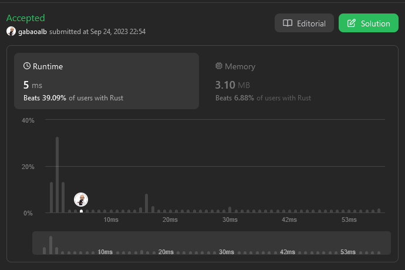
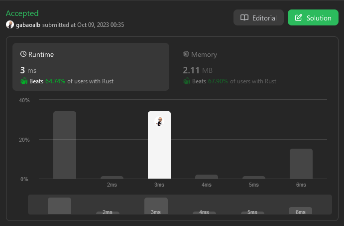

A collection of my solutions to each problem of http://leetcode.com

I aim to write every solution in Rust in order to master the language.

This repo is under a slowly construction...

<table>
  <tr>
    <td valign="top">
        <figure class="image">
            
            <figcaption>1. <a href="https://github.com/Gabones/leet-code/tree/master/two-sum">Two Sum</a></figcaption>
        </figure>
    </td>
    <td valign="top">
        <figure class="image">
            
            <figcaption>2. <a href="https://github.com/Gabones/leet-code/tree/master/add-two-numbers">Add Two Numbers</a></figcaption>
        </figure>
    </td>
    <td valign="top">
        <figure class="image">
            
            <figcaption><a href="https://github.com/Gabones/leet-code/tree/master/two-sum">1. Two Sum</a></figcaption>
        </figure>
    </td>
  </tr>
  <tr>
    <td valign="top">
        <figure class="image">
            
            <figcaption><a href="https://github.com/Gabones/leet-code/tree/master/two-sum">1. Two Sum</a></figcaption>
        </figure>
    </td>
    <td valign="top">
        <figure class="image">
            
            <figcaption><a href="https://github.com/Gabones/leet-code/tree/master/two-sum">1. Two Sum</a></figcaption>
        </figure>
    </td>
    <td valign="top">
        <figure class="image">
            
            <figcaption><a href="https://github.com/Gabones/leet-code/tree/master/two-sum">1. Two Sum</a></figcaption>
        </figure>
    </td>
  </tr>
</table>

2. [Add Two Numbers](https://github.com/Gabones/leet-code/tree/master/add-two-numbers)
3. [Longest Substring Without Repeating Characters](https://github.com/Gabones/leet-code/tree/master/longest-substring)
4. [Median of Two Sorted Arrays](https://github.com/Gabones/leet-code/tree/master/median-sorted-arrays)
5. [Longest Palindromic Substring](https://github.com/Gabones/leet-code/tree/master/long-palind-substr)
6. [Zigzag Conversion](https://github.com/Gabones/leet-code/tree/master/zigzag-conversion)
7. [Reverse Integer](https://github.com/Gabones/leet-code/tree/master/reverse-integer)
8. [String to Integer (atoi)](https://github.com/Gabones/leet-code/tree/master/string-to-integer)
9. [Palindrome Number](https://github.com/Gabones/leet-code/tree/master/palindrome-number)
10. [Regular Expression Matching](https://github.com/Gabones/leet-code/tree/master/regular-expression-matching)
11. [Container With Most Water](https://github.com/Gabones/leet-code/tree/master/container-with-most-water)
12. [Integer to Roman](https://github.com/Gabones/leet-code/tree/master/integer-to-roman)
13. [Roman to Integer](https://github.com/Gabones/leet-code/tree/master/roman-to-integer)