A collection of my solutions to each problem of http://leetcode.com

I aim to write every solution in Rust in order to master the language.

This repo is under a slowly construction...

<table>
  <tr>
    <td valign="top">
        <figure class="image" style="display: flex; align-items: stretch; justify-content: center; flex-direction: column;">
            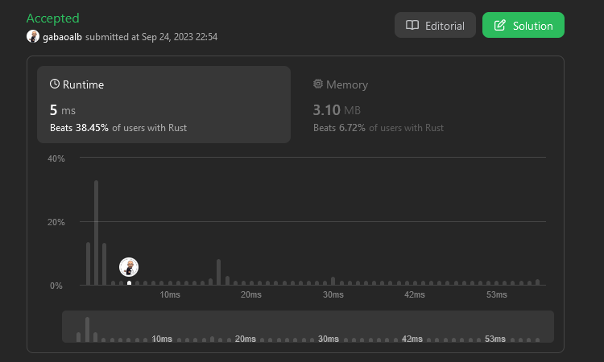
            <figcaption>1. <a href="https://github.com/Gabones/leet-code/tree/master/two-sum">Two Sum</a></figcaption>
        </figure>
    </td>
    <td valign="top">
        <figure class="image" style="display: flex; align-items: stretch; justify-content: center; flex-direction: column;">
            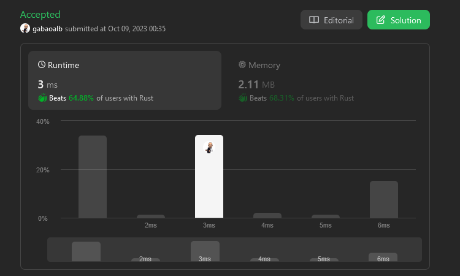
            <figcaption>2. <a href="https://github.com/Gabones/leet-code/tree/master/add-two-numbers">Add Two Numbers</a></figcaption>
        </figure>
    </td>
    </td>
  </tr>
  <tr>
    <td valign="top">
        <figure class="image" style="display: flex; align-items: stretch; justify-content: center; flex-direction: column;">
            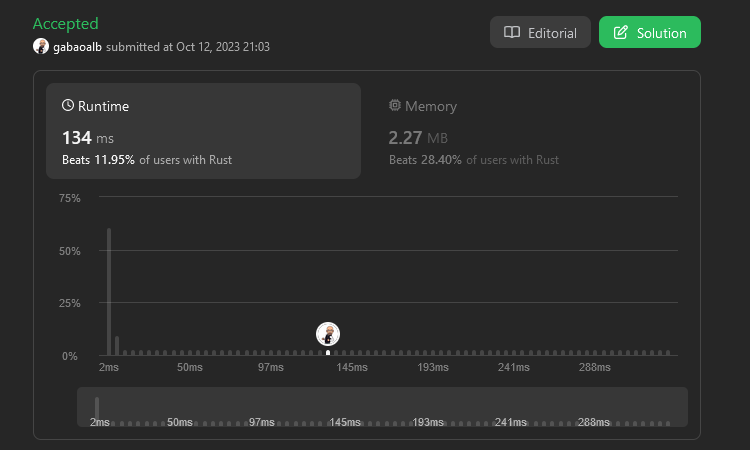
            <figcaption>3. <a href="https://github.com/Gabones/leet-code/tree/master/longest-substring">Longest Substring Without Repeating</a></figcaption>
        </figure>
    </td>
    <td valign="top">
        <figure class="image" style="display: flex; align-items: stretch; justify-content: center; flex-direction: column;">
            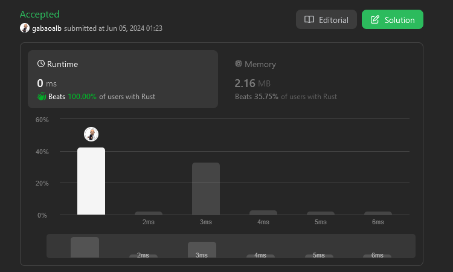
            <figcaption>4. <a href="https://github.com/Gabones/leet-code/tree/master/median-sorted-arrays">Median of Two Sorted Arrays</a></figcaption>
        </figure>
    </td>
  </tr>
  <tr>
    <td valign="top">
        <figure class="image" style="display: flex; align-items: stretch; justify-content: center; flex-direction: column;">
            
            <figcaption>5. <a href="https://github.com/Gabones/leet-code/tree/master/long-palind-substr">Longest Palindromic Substring</a></figcaption>
        </figure>
    </td>
    <td valign="top">
        <figure class="image" style="display: flex; align-items: stretch; justify-content: center; flex-direction: column;">
            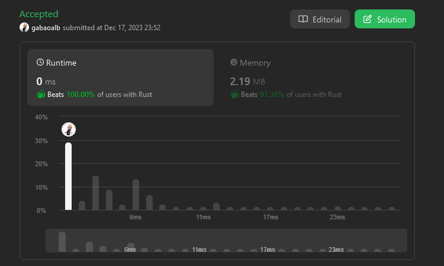
            <figcaption>6. <a href="https://github.com/Gabones/leet-code/tree/master/zigzag-conversion">Zigzag Conversion</a></figcaption>
        </figure>
    </td>
  </tr>
  <tr>
    <td valign="top">
        <figure class="image" style="display: flex; align-items: stretch; justify-content: center; flex-direction: column;">
            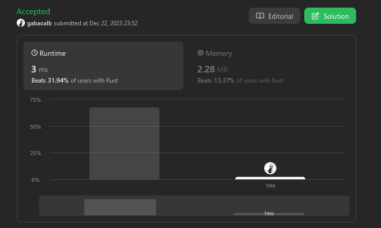
            <figcaption>7. <a href="https://github.com/Gabones/leet-code/tree/master/reverse-integer">Reverse Integer</a></figcaption>
        </figure>
    </td>
    <td valign="top">
        <figure class="image" style="display: flex; align-items: stretch; justify-content: center; flex-direction: column;">
            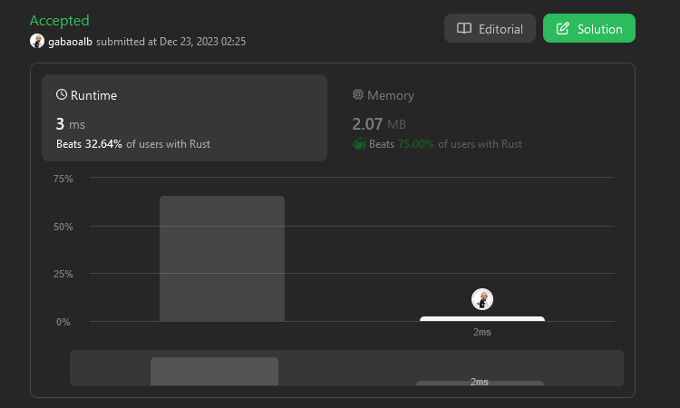
            <figcaption>8. <a href="https://github.com/Gabones/leet-code/tree/master/string-to-integer">String to Integer (atoi)</a></figcaption>
        </figure>
    </td>
  </tr>
  <tr>
    <td valign="top">
        <figure class="image" style="display: flex; align-items: stretch; justify-content: center; flex-direction: column;">
            
            <figcaption>9. <a href="https://github.com/Gabones/leet-code/tree/master/palindrome-number">Palindrome Number</a></figcaption>
        </figure>
    </td>
    <td valign="top">
        <figure class="image" style="display: flex; align-items: stretch; justify-content: center; flex-direction: column;">
            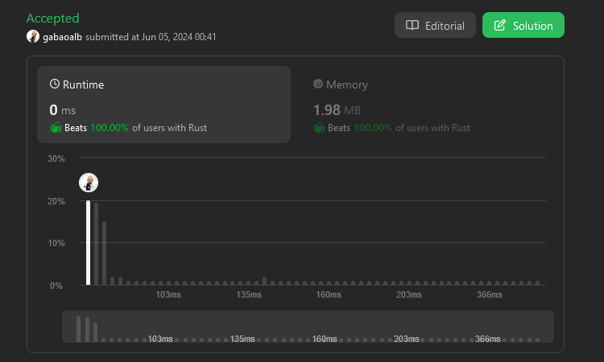
            <figcaption>10. <a href="https://github.com/Gabones/leet-code/tree/master/regular-expression-matching">Regular Expression Matching</a></figcaption>
        </figure>
    </td>
  </tr>
  <tr>
    <td valign="top">
        <figure class="image" style="display: flex; align-items: stretch; justify-content: center; flex-direction: column;">
            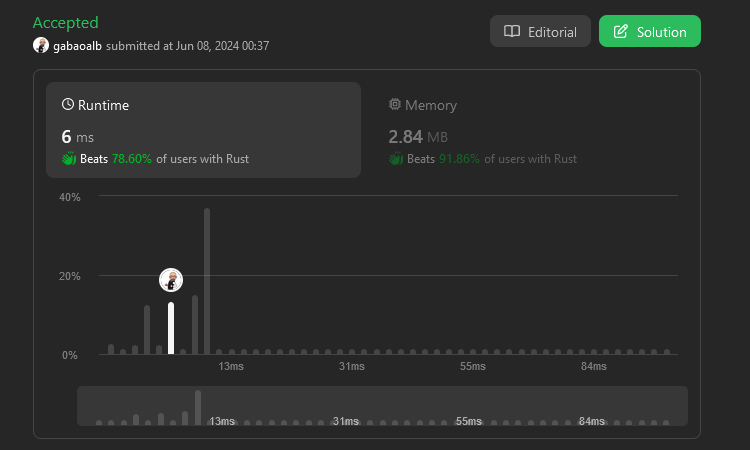
            <figcaption>11. <a href="https://github.com/Gabones/leet-code/tree/master/container-with-most-water">Container With Most Water</a></figcaption>
        </figure>
    </td>
    <td valign="top">
        <figure class="image" style="display: flex; align-items: stretch; justify-content: center; flex-direction: column;">
            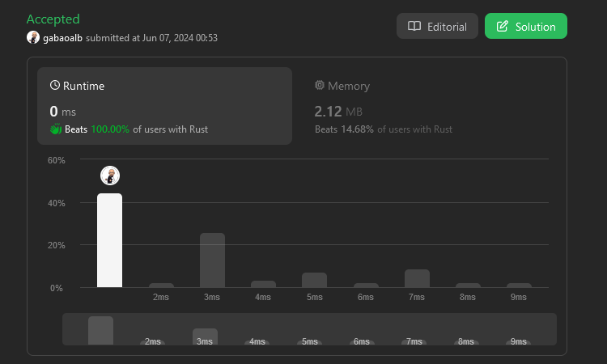
            <figcaption>12. <a href="https://github.com/Gabones/leet-code/tree/master/integer-to-roman">Integer to Roman</a></figcaption>
        </figure>
    </td>
  </tr>
  <tr>
    <td valign="top">
        <figure class="image" style="display: flex; align-items: stretch; justify-content: center; flex-direction: column;">
            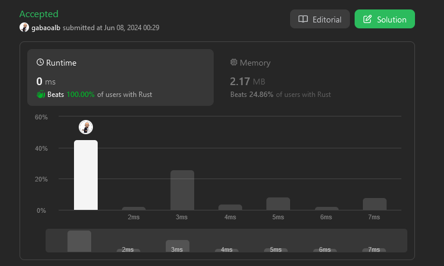
            <figcaption>13. <a href="https://github.com/Gabones/leet-code/tree/master/roman-to-integer">Roman to Integer</a></figcaption>
        </figure>
    </td>
  </tr>
</table>
